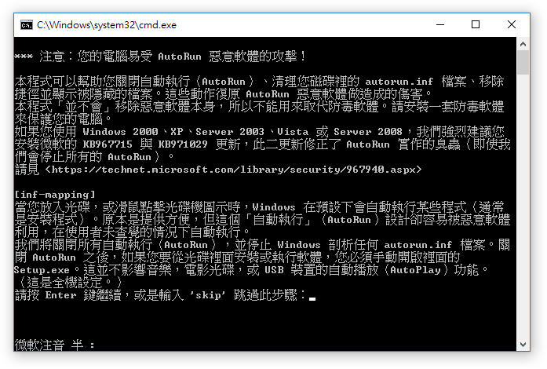

usb_vaccine.cmd
===============

USB malware immunity script and hidden files revealer.

**Does not remove malware.**
**Must be used in conjunction with an antivirus program.**

[Download](https://github.com/Explorer09/usb_vaccine/raw/master/usb_vaccine.cmd)

What does it do
---------------

* Detects and removes AutoRun commands for your Command Processor (cmd.exe).
* Disables AutoRun entirely, for both CD-ROM drives, and USB flash drives. The
  [IniFileMapping method](http://www.computerworld.com/article/2481506). Most
  secure.
* [Cleans MountPoints2 registry key](http://www.kb.cert.org/vuls/id/889747),
  which is the AutoRun cache used by OS, for all users.
* Disables "Hide extensions for known file types", for security reasons.
* Show extensions for PIF files, also for security reasons.
* Restores shortcut arrow icons, that may be removed due to malware's infection
  (registry hack).

Travels through the root directories of all drives (including USB drives and
SD/MMC cards), and:

* deletes all shortcuts, file symbolic links, and (malicious) executable files
  that mimic regular folders;
* un-hide all files that have been made hidden by malware;
* deletes autorun.inf file, and creates a folder with the same name to prevent
  further infections. This is the same technique used by most USB protectors on
  the Web.

All actions may be skipped and not done by user request.

What does it NOT do
-------------------

* It does NOT kill or remove the malware. This is antivirus program's job.
* It does NOT make an already-infected system clean. This scripts is useful on
  **non-infected** system, to enhance security and prevent new infections.
* It does NOT sit in the system tray or monitor every insertion/removal of USB
  drives or SD/MMC cards. On an ideal secure system, this is not needed, as the
  AutoRun is disabled and nothing will be run automatically. (Think of Mac OS X
  and Linux.)

How to use
----------

Requires Windows 2000 or later. Tested to work with Windows 2000 through
Windows 10.

1. Download the script file (usb_vaccine.cmd).
2. Unplug all of your USB flash drives, so that if your USB flash drives are
   infected they won't interfere with your computer.
3. Right-click on "usb_vaccine.cmd" file and select "Run as Administrator".

4. Follow the instructions on screen.

You may try `usb_vaccine.cmd --help` on the command line for additional options
you can use.

Copyright and license
---------------------

Written by Kang-Che Sung.

Licensed under GNU Lesser General Public License v2.1 or later. This is free
(libre) and open source software.

This scripts comes with ABSOLUTELY NO WARRANTY.

-------------------------------------------------------------------------------
(zh-TW)

usb_vaccine.cmd
===============

USB 病毒免疫暨隱藏檔現形程式

**注意：不會真正移除病毒，請搭配防毒軟體一起使用**

[下載](https://github.com/Explorer09/usb_vaccine/raw/master/usb_vaccine_zh-TW.cmd)

這做什麼
--------

* 偵測並移除命令處裡程式 (cmd.exe) 的 AutoRun 命令。
* 關閉所有的 AutoRun，CD-ROM 與 USB 隨身碟都關閉。使用最安全的
  [IniFileMapping 方法](http://www.computerworld.com/article/2481506)。
* 為所有使用者
  [清理 MountPoints2 登錄機碼](http://www.kb.cert.org/vuls/id/889747)
  ，MountPoints2 為作業系統的 AutoRun 快取。
* 取消「隱藏已知檔案類型的副檔名」，為了安全性。
* 顯示 PIF 檔案的附檔名，也是為了安全性。
* 復原可能被病毒攻擊（修改登錄）所移除的捷徑箭頭圖示。

針對每一個磁碟機（包括 USB 碟與記憶卡）的根目錄做以下事情：

* 刪除所有捷徑、檔案符號連結 (symbolic links) 以及偽裝成一般資料夾的（惡意）執行
  檔；
* 解除所有被病毒隱藏的檔案；
* 刪除 autorun.inf 檔案，並建立相同名稱的資料夾，以防止再次被感染。這與網路上各
  大 USB 防毒程式用的是同樣的技巧。

所有的動作都可以被使用者指示跳過不做。

「不會」做這些事情
------------------

* 它不會中止病毒程序，不會殺死或移除病毒。這些是防毒軟體的工作。
* 它不能把被感染的系統變乾淨。這個腳本程式適合用在 **未感染** 的系統上，加強安
  全性，並阻止新的感染。
* 它不會掛在系統工作列上或是監控所有 USB 碟或記憶卡的插拔動作。在一個理想安全
  的系統下，這些完全沒必要，因為當 AutoRun 關閉後沒有一個程式會被自動執行。
  （Mac OS X 與 Linux 皆如此。）

如何使用
--------

需要 Windows 2000 以上。從 Windows 2000 到 Windows 10 都有測試過可以使用。

1. 下載腳本檔 (usb_vaccine_zh-TW.cmd)
2. 拔除所有的 USB 隨身碟。這樣如果 USB 隨身碟受到感染，您的電腦就不會受隨身碟
   的影響。
3. 在 usb_vaccine_zh-TW.cmd 檔案上按滑鼠右鍵，選取「以系統管理員身分執行」。

4. 照著螢幕上的指示操作。

您可以在命令列上輸入 `usb_vaccine.cmd --help` 來查看更多可用的選項。

版權
----

作者：宋岡哲 (Kang-Che Sung)

採用 GNU 較寬鬆公共授權條款 (LGPL) v2.1 版（或任何更新版）授權。這是自由且開放
原始碼軟體。

本軟體不附任何擔保。
